# That Place — Entity Relationship Diagram

> Reflects SPEC.md v4.8. Update this file whenever the data model changes.

```mermaid
erDiagram
    User {
        int id PK
        string email
        string password_hash
        bool is_that_place_admin
        datetime created_at
    }
    Tenant {
        int id PK
        string name
        string slug
        string timezone
        bool is_active
        datetime created_at
    }
    TenantUser {
        int id PK
        int user_id FK
        int tenant_id FK
        string role
        datetime joined_at
    }
    Site {
        int id PK
        int tenant_id FK
        string name
        string description
        float latitude
        float longitude
        datetime created_at
    }
    DeviceType {
        int id PK
        string name
        string slug
        string description
        string connection_type
        bool is_push
        int default_offline_threshold_minutes
        int command_ack_timeout_seconds
        json commands
        json stream_type_definitions
        bool is_active
        datetime created_at
    }
    Device {
        int id PK
        int tenant_id FK
        int site_id FK
        int device_type_id FK
        int gateway_device_id FK
        string name
        string serial_number
        string status
        string topic_format
        int offline_threshold_override_minutes
        datetime created_at
    }
    DeviceHealth {
        int id PK
        int device_id FK
        bool is_online
        datetime last_seen_at
        datetime first_active_at
        int signal_strength
        int battery_level
        string activity_level
        datetime updated_at
    }
    Stream {
        int id PK
        int device_id FK
        string key
        string label
        string unit
        string data_type
        bool display_enabled
        datetime created_at
    }
    StreamReading {
        int id PK
        int stream_id FK
        json value
        datetime timestamp
        datetime ingested_at
    }
    ThirdPartyAPIProvider {
        int id PK
        string name
        string slug
        string description
        string base_url
        string auth_type
        json auth_param_schema
        json discovery_endpoint
        json detail_endpoint
        json available_streams
        int default_poll_interval_seconds
        bool is_active
        datetime created_at
    }
    DataSource {
        int id PK
        int tenant_id FK
        int provider_id FK
        string name
        json credentials
        json auth_token_cache
        bool is_active
        datetime created_at
    }
    DataSourceDevice {
        int id PK
        int datasource_id FK
        int virtual_device_id FK
        string external_device_id
        string external_device_name
        json active_stream_keys
        datetime last_polled_at
        string last_poll_status
        string last_poll_error
        bool is_active
    }
    NotificationGroup {
        int id PK
        int tenant_id FK
        string name
        bool is_system
        datetime created_at
    }
    NotificationGroupMember {
        int id PK
        int group_id FK
        int tenant_user_id FK
        datetime added_at
    }
    Rule {
        int id PK
        int tenant_id FK
        int created_by FK
        string name
        string description
        bool is_active
        int cooldown_minutes
        json active_days
        time active_from
        time active_to
        string condition_group_operator
        bool current_state
        datetime last_fired_at
        datetime created_at
        datetime updated_at
    }
    RuleStreamIndex {
        int id PK
        int stream_id FK
        int rule_id FK
    }
    RuleConditionGroup {
        int id PK
        int rule_id FK
        string logical_operator
        int order
    }
    RuleCondition {
        int id PK
        int group_id FK
        int stream_id FK
        string condition_type
        string operator
        string threshold_value
        int staleness_minutes
        int order
    }
    RuleAction {
        int id PK
        int rule_id FK
        int target_device_id FK
        string action_type
        json notification_channels
        json group_ids
        json user_ids
        string message_template
        string command
    }
    RuleAuditLog {
        int id PK
        int rule_id FK
        int changed_by FK
        datetime changed_at
        json changed_fields
    }
    Alert {
        int id PK
        int rule_id FK
        int tenant_id FK
        int acknowledged_by FK
        int resolved_by FK
        datetime triggered_at
        string status
        string acknowledged_note
        datetime acknowledged_at
        datetime resolved_at
    }
    Notification {
        int id PK
        int user_id FK
        int alert_id FK
        string notification_type
        string event_type
        json event_data
        string channel
        datetime sent_at
        datetime read_at
        string delivery_status
    }
    CommandLog {
        int id PK
        int device_id FK
        int sent_by FK
        int triggered_by_rule_id FK
        string command_name
        json params_sent
        datetime sent_at
        datetime ack_received_at
        string status
    }
    DataExport {
        int id PK
        int tenant_id FK
        int exported_by FK
        json stream_ids
        datetime date_from
        datetime date_to
        datetime exported_at
    }
    Dashboard {
        int id PK
        int tenant_id FK
        int created_by FK
        string name
        datetime created_at
    }
    DashboardWidget {
        int id PK
        int dashboard_id FK
        string widget_type
        json stream_ids
        json config
        json position
    }

    %% ── Auth & Tenancy ──────────────────────────────────────────
    User ||--o{ TenantUser : "member of"
    Tenant ||--|{ TenantUser : "has"
    Tenant ||--o{ Site : "has"

    %% ── Devices ─────────────────────────────────────────────────
    Site ||--o{ Device : "contains"
    Tenant ||--o{ Device : "owns"
    DeviceType ||--o{ Device : "typed as"
    Device ||--o| Device : "bridged via Scout"
    Device ||--|| DeviceHealth : "has"
    Device ||--o{ Stream : "reports"
    Stream ||--o{ StreamReading : "stores"

    %% ── 3rd Party API ───────────────────────────────────────────
    Tenant ||--o{ DataSource : "has"
    ThirdPartyAPIProvider ||--o{ DataSource : "configures"
    DataSource ||--o{ DataSourceDevice : "discovers"
    DataSourceDevice ||--|| Device : "creates virtual"

    %% ── Notification Groups ─────────────────────────────────────
    Tenant ||--o{ NotificationGroup : "has"
    NotificationGroup ||--o{ NotificationGroupMember : "has"
    TenantUser ||--o{ NotificationGroupMember : "belongs to"

    %% ── Rules Engine ────────────────────────────────────────────
    Tenant ||--o{ Rule : "has"
    User ||--o{ Rule : "creates"
    Rule ||--|{ RuleConditionGroup : "has"
    RuleConditionGroup ||--|{ RuleCondition : "contains"
    RuleCondition ||--o| Stream : "references"
    Rule ||--|{ RuleAction : "has"
    RuleAction ||--o| Device : "targets"
    Rule ||--o{ RuleStreamIndex : "indexed by"
    Stream ||--o{ RuleStreamIndex : "indexes"
    Rule ||--o{ RuleAuditLog : "audited by"
    User ||--o{ RuleAuditLog : "changed by"

    %% ── Alerts & Notifications ──────────────────────────────────
    Rule ||--o{ Alert : "fires"
    Tenant ||--o{ Alert : "receives"
    User ||--o{ Alert : "acknowledges"
    Alert ||--o{ Notification : "generates"
    User ||--o{ Notification : "receives"

    %% ── Device Commands ─────────────────────────────────────────
    Device ||--o{ CommandLog : "receives"
    User ||--o{ CommandLog : "sends"
    Rule ||--o{ CommandLog : "triggers"

    %% ── Dashboards & Exports ────────────────────────────────────
    Tenant ||--o{ Dashboard : "has"
    User ||--o{ Dashboard : "creates"
    Dashboard ||--o{ DashboardWidget : "contains"
    Tenant ||--o{ DataExport : "has"
    User ||--o{ DataExport : "exports"
```

---

## Entity Count: 26

| Group | Entities |
|-------|----------|
| Auth & Tenancy | User, Tenant, TenantUser |
| Geography | Site |
| Device Platform | DeviceType, Device, DeviceHealth |
| Data Streams | Stream, StreamReading |
| 3rd Party APIs | ThirdPartyAPIProvider, DataSource, DataSourceDevice |
| Notifications | NotificationGroup, NotificationGroupMember |
| Rules Engine | Rule, RuleStreamIndex, RuleConditionGroup, RuleCondition, RuleAction, RuleAuditLog |
| Alerts & Notifications | Alert, Notification |
| Commands | CommandLog |
| Dashboards | Dashboard, DashboardWidget |
| Exports | DataExport |
